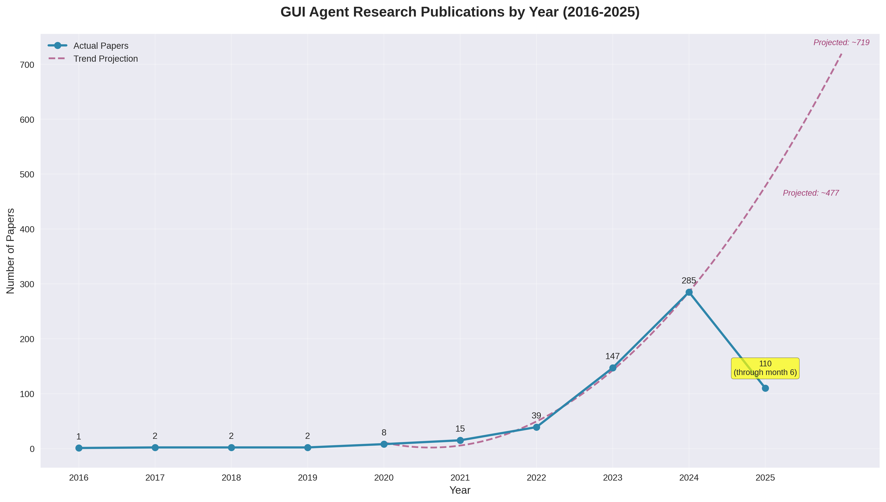
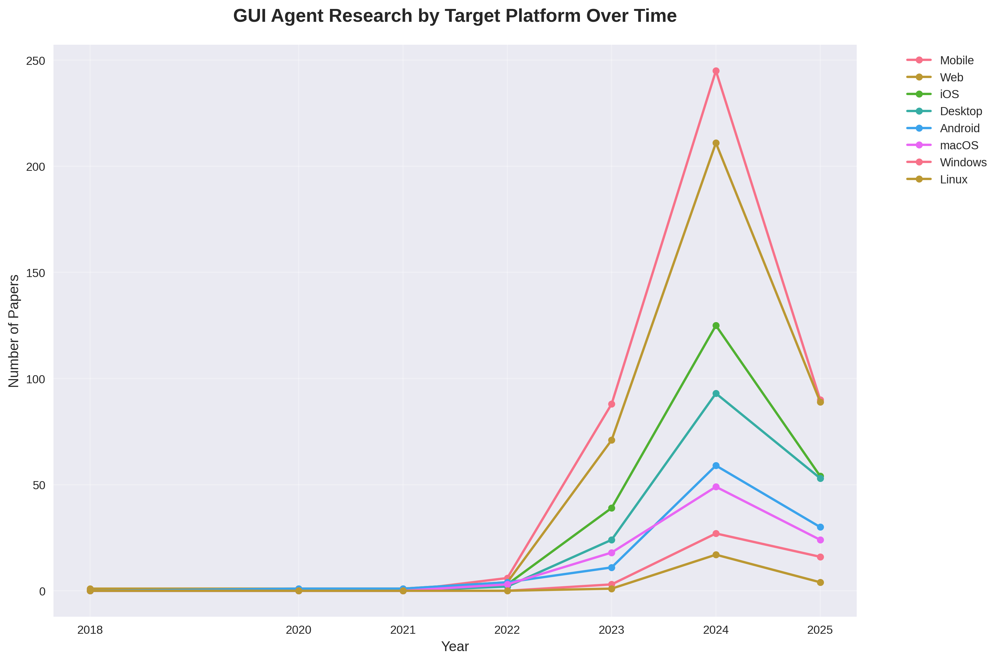
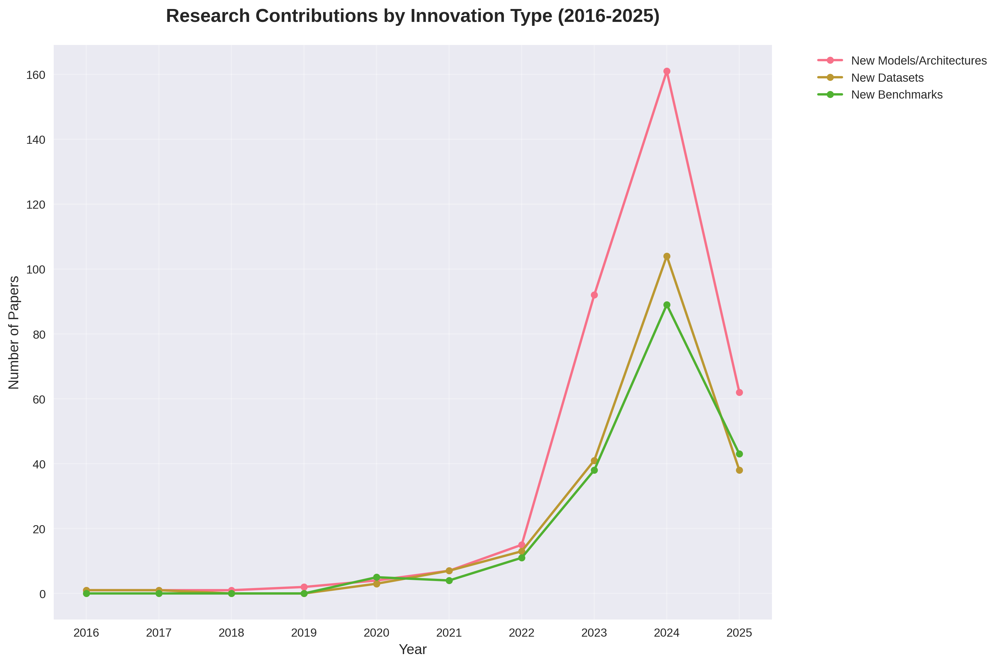
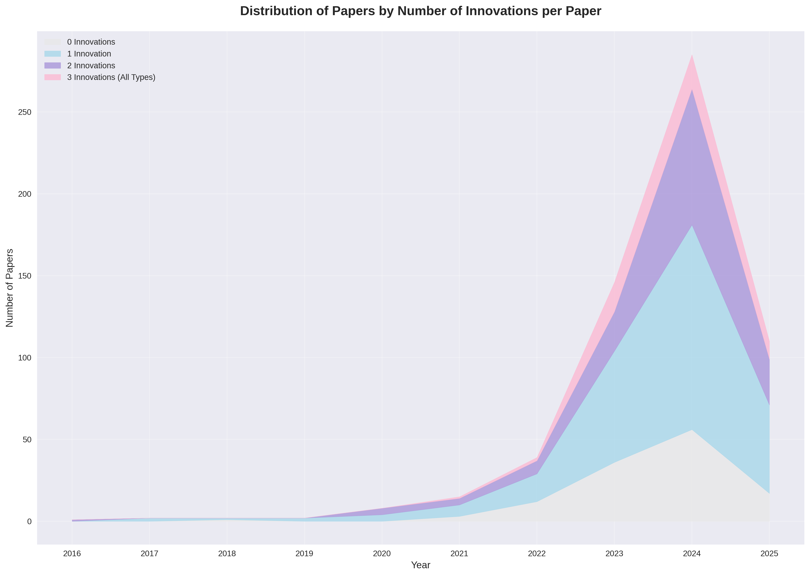

# Compound Innovation Analysis: GUI Agent Research Landscape

*Generated: 2025-08-14*

## Executive Summary

This analysis examines the evolution of innovation patterns in GUI agent research from 2016-2025, focusing on whether the field is producing more comprehensive contributions over time. The key finding is that **the field is becoming more comprehensive**, with papers increasingly introducing multiple innovations simultaneously rather than single-focus contributions.

## Key Findings

### 🔬 **Compound Innovation Trends**
- **33.6%** of all papers (205/610) introduce 2+ innovations
- **Steady increase in comprehensiveness**: Papers with 2+ innovations rose from 25.6% (2022) to 36.5% (2024)
- **Multi-innovation papers are becoming increasingly common**

### 📊 **Innovation Distribution**
- **0 innovations**: Decreasing proportion over time
- **1 innovation**: Most common category, but relatively decreasing
- **2 innovations**: Rapidly increasing
- **3 innovations**: All three types (Models/Architectures, Datasets, Benchmarks) - rare but growing

## Research Question Analysis

### 1. Platform Consolidation vs. Fragmentation

**Finding: FRAGMENTATION is occurring**

| Metric | Early Years (2016-2018) | Recent Years (2023-2025) | Trend |
|--------|-------------------------|--------------------------|-------|
| Platform Diversity | 1.7 avg platforms/year | 25.0 avg platforms/year | ↗️ **+1,371%** |
| Concentration Index | 0.667 | 0.190 | ↘️ **-72%** |

**Interpretation**: 
- Researchers are **exploring new frontiers** rather than converging on dominant platforms
- Platform landscape is becoming more diverse and competitive
- Shift from Mobile/Android/Web dominance to broader Mobile/Web/iOS ecosystem

### 2. Innovation Lifecycle Pattern

**Finding: Synchronized Innovation Peak**

All innovation types peaked simultaneously in **2024**:
- 🤖 **New Models/Architectures**: 161 papers
- 📊 **New Datasets**: 104 papers  
- 🎯 **New Benchmarks**: 89 papers

**Key Insight**: Rather than a sequential pattern (models → datasets → benchmarks), the field shows **synchronized innovation** where comprehensive papers introduce multiple contribution types together. Technical contributions (models/architectures) are the dominant innovation type.

### 3. Acceleration Indicators & Sustainability

**Finding: Exponential Growth Approaching Inflection Point**

#### Growth Pattern Analysis
- **Early period average growth**: 33.3%
- **Recent period average growth**: 102.7%
- **Classification**: Accelerating (exponential-like growth)

#### Year-over-Year Growth Rates
| Period | Growth Rate | Papers | Status |
|--------|-------------|---------|---------|
| 2019→2020 | +300.0% | 2→8 | 🚀 Takeoff |
| 2020→2021 | +87.5% | 8→15 | 📈 Strong |
| 2021→2022 | +160.0% | 15→39 | 📈 Strong |
| 2022→2023 | +274.4% | 39→146 | 🚀 Explosive |
| 2023→2024 | +95.2% | 146→285 | 📈 Strong |
| 2024→2025 | -61.4% | 285→110 | ⚠️ Decline* |

*\*2025 data is partial (through month 6)*

#### Sustainability Assessment
- ⚠️ **Warning**: Very high growth rates may be unsustainable
- 📉 **Potential saturation**: 2024→2025 shows decline (though 2025 incomplete)
- 🔮 **Projections**: Models suggest potential correction/stabilization ahead

## Innovation Type Breakdown

### Total Contributions by Type
1. **New Models/Architectures**: 345 papers (56.6%)
2. **New Datasets**: 208 papers (34.1%)
3. **New Benchmarks**: 190 papers (31.1%)

### Innovation Lifecycle Insights
- **All innovation types peaked in 2024**, suggesting field maturity
- **Technical contributions (models/architectures)** dominate the field
- **Benchmarks** show steady growth, indicating increased focus on evaluation
- **Datasets** remain crucial infrastructure contributions

## Platform Evolution Analysis

### Dominant Platforms by Era

#### Early Era (2016-2018)
1. Mobile
2. Android  
3. Web

#### Recent Era (2023-2025)
1. Mobile
2. Web
3. iOS

### Platform Fragmentation Metrics
- **Unique platforms tracked**: 25+ distinct platforms in recent years
- **Herfindahl-Hirschman Index**: Decreased from 0.667 to 0.190 (more competitive)
- **Top-3 platform dominance**: Reduced concentration

## Implications & Future Outlook

### Positive Indicators
✅ **Comprehensive contributions increasing** - Field producing more holistic research  
✅ **Platform diversity expanding** - Broader applicability and innovation  
✅ **Multi-disciplinary approach** - Integration of models, data, and evaluation  

### Potential Concerns
⚠️ **Growth sustainability** - Exponential rates may not be maintainable  
⚠️ **Quality vs. quantity** - Rapid growth may impact research depth  
⚠️ **Resource fragmentation** - Platform diversity may scatter efforts  

### Strategic Recommendations

1. **For Researchers**:
   - **Realistic target**: Aim for comprehensive contributions (2+ innovations) - achieved by 33.6% of papers
   - **Technical focus**: Emphasize novel models/architectures as the primary innovation driver
   - Consider cross-platform applicability to address fragmentation
   - Prepare for potential field maturation/slowdown

2. **For Field Development**:
   - Develop frameworks for comparing diverse approaches across platforms
   - Plan for sustainable growth patterns given current exponential trends

3. **For Future Research**:
   - **Balanced portfolio**: Combine technical innovations with datasets and benchmarks
   - Focus on consolidating fragmented platform efforts
   - Prepare methodological innovations for continued growth beyond current saturation indicators

## Research Timeline Visualizations

### GUI Agent Research Timeline - Exponential Growth with Future Projections

This chart shows the explosive growth in GUI agent research from 2016 to 2024. We see a classic exponential curve starting with just 1-2 papers annually in the early years, then dramatic acceleration from 2020 onwards. The peak year so far is 2024 with 285 papers. The trend analysis projects approximately 477 papers for 2025 and 719 for 2026, though our partial 2025 data suggests this may be overly optimistic. The field appears to be approaching a potential inflection point where this exponential growth rate may not be sustainable.

### Platform Research Trends - From Mobile Focus to Diverse Ecosystem

This multi-line chart reveals the platform fragmentation story in GUI agent research. Early years were dominated by Mobile and Android research, with Web as a secondary focus. However, we see dramatic diversification over time - the recent years show research spanning Mobile, Web, iOS, Desktop, and Android platforms more equally. This fragmentation indicates researchers are exploring new frontiers rather than converging on dominant platforms. The diversity has increased by over 1,300%, suggesting the field is in an exploratory phase across multiple interaction paradigms.

### Innovation Type Evolution - Technical Contributions Lead the Way

This chart shows how different types of contributions have evolved over time. Technical contributions (new models and architectures combined) clearly dominate, peaking at 161 papers in 2024. New datasets and benchmarks follow similar growth patterns but at lower volumes - 104 and 89 papers respectively in 2024. All three innovation types show synchronized peaks in 2024, indicating the field has reached a maturity point where researchers are producing comprehensive contributions across all categories simultaneously, rather than the sequential pattern you might expect.

### The Rise of Comprehensive Research - Multi-Innovation Papers on the Rise

**How to Read This Stacked Area Chart:**

This chart shows the total number of papers each year, broken down by how many innovations each paper contributes:

- **Gray (bottom)**: Papers with **0 innovations** - these are survey papers, position papers, or papers that don't introduce new technical contributions
- **Light Blue**: Papers with **1 innovation** - traditional single-focus research (e.g., just a new model, or just a new dataset)
- **Purple**: Papers with **2 innovations** - comprehensive papers combining two contribution types (e.g., new model + new dataset)
- **Pink (top)**: Papers with **3 innovations** - highly comprehensive papers introducing all three types: technical contribution + dataset + benchmark

**Key Insights:**
- The **total height** at any year shows the total number of papers published that year
- The **relative proportions** show how the field is evolving toward more comprehensive research
- **Gray area shrinking** = fewer papers with no major innovations
- **Purple and pink areas growing** = more multi-innovation papers
- By 2024, **36.5% of papers** (purple + pink areas) introduce multiple innovations, up from 25.6% in 2022

This trend suggests the field is maturing beyond single-contribution papers toward more holistic research that combines technical advances with datasets and evaluation frameworks.

## Technical Notes

### Data Sources
- **Dataset**: `keyword_filtered_enriched_qwen3_8b.json`
- **Papers analyzed**: 610 papers (2016-2025)
- **Innovation types tracked**: 3 categories (models/architectures, datasets, benchmarks)

### Methodology
- **Compound innovation counting**: Binary flags for each innovation type
- **Platform consolidation**: Herfindahl-Hirschman Index and diversity metrics
- **Growth analysis**: Polynomial trend fitting and year-over-year rates
- **Lifecycle analysis**: Peak detection and temporal correlation

### Visualizations Generated
1. `timeline_overall.png` - Overall research timeline with projections
2. `timeline_platforms.png` - Platform trends over time
3. `timeline_innovations.png` - Innovation type trends
4. `compound_innovations.png` - Stacked area chart of compound innovations

---

*This analysis provides quantitative evidence that the GUI agent research field is evolving toward more comprehensive, multi-faceted contributions while simultaneously diversifying across platforms. The field appears to be approaching a potential inflection point that may require strategic adaptation to maintain growth momentum.*